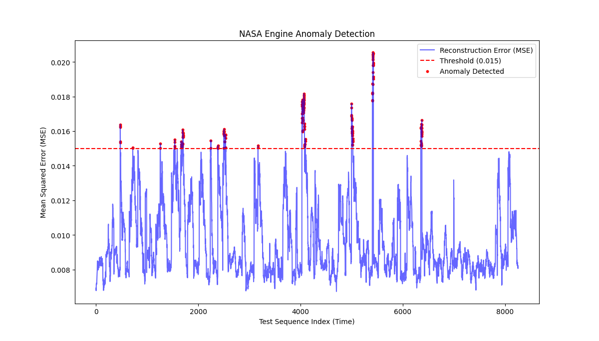

# 🏭 Hybrid Anomaly Detection in Industrial IoT using Deep Learning

**Video Explanation:** [Link to your 8-10 Min Video will go here]

## 📖 1. Title
**Hybrid Anomaly Detection for Predictive Maintenance in Turbofan Engines.**

##  2. Problem Statement
In industrial IoT, equipment failure leads to costly unplanned downtime. The objective of this project is to predict impending equipment failure before it happens by analyzing multi-variate time-series sensor data (e.g., temperature, pressure, vibration). By identifying anomalies in the sensor data early, maintenance can be scheduled proactively, saving time and resources.

## 🧠 3. Methodology
This project applies Deep Learning anomaly detection techniques to time-series telemetry data. 

The solution relies on training an **LSTM Autoencoder** exclusively on "healthy" engine data to establish a baseline of normal operation. The Long Short-Term Memory (LSTM) network is specifically used to capture the complex temporal dependencies and sequential patterns in the sensor data. 

When the trained model is fed data from a degrading engine, it fails to reconstruct the new, erratic patterns. This causes the Reconstruction Error (Mean Squared Error) to spike, effectively acting as an early warning system for total system failure.

## 📊 4. Results
The model successfully identifies engine degradation cycles before catastrophic failure. The graph below plots the Mean Squared Error (MSE) against the sequence time. When the blue line crosses the red threshold, an anomaly is flagged.



## 💾 5. Dataset
The data used is the NASA CMAPSS (Commercial Modular Aero-Propulsion System Simulation) Dataset, containing simulated run-to-failure telemetry from turbofan engines.
* **Dataset Source:** [Kaggle: CMAPSS Jet Engine Simulated Data](https://www.kaggle.com/datasets/palbha/cmapss-jet-engine-simulated-data)
* *Note: The raw data files are not included in this repository. Please download them from the link above and place them in the `data/` directory.*

## 🚀 6. How to Run

**1. Clone the repository:**
```bash
git clone [https://github.com/Atharva-Ramawat/Industrial-IOT-Anomaly-Detection.git](https://github.com/Atharva-Ramawat/Industrial-IOT-Anomaly-Detection.git)
cd Industrial-IOT-Anomaly-Detection
